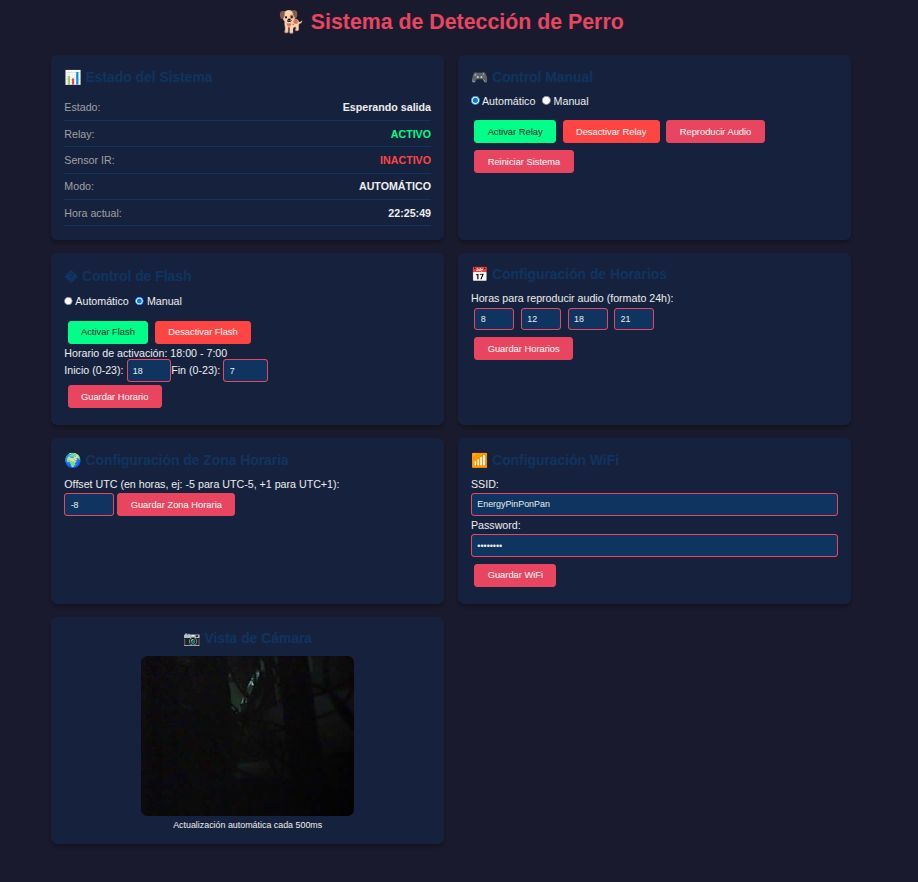
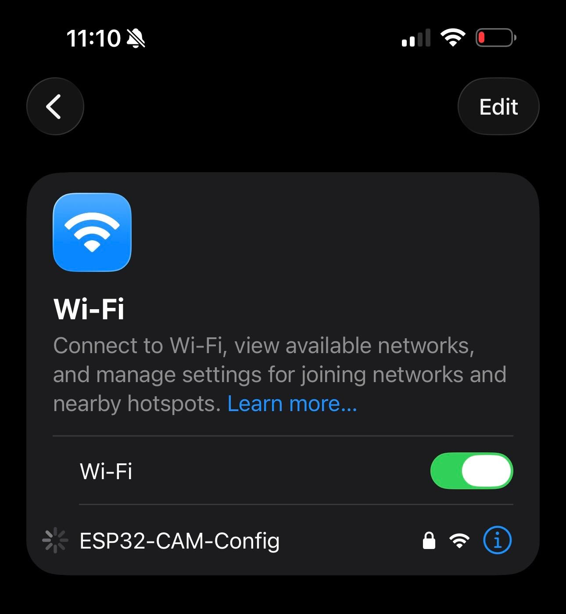
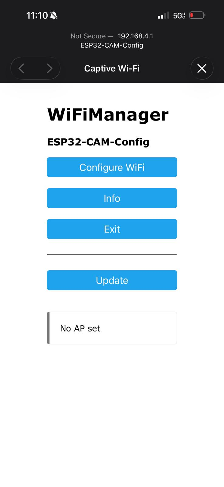
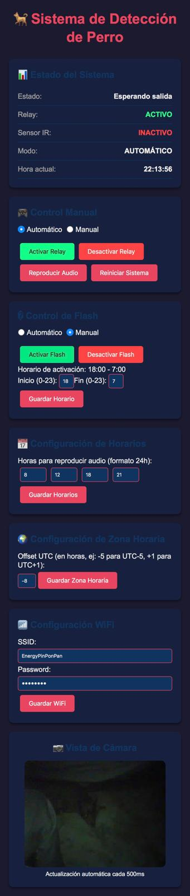

# ESP32-CAM Sistema de Detección de Perro

Sistema completo para detección de perros usando ESP32-CAM con relay, sensor IR, módulo de audio ISD1820 y control de flash LED. Incluye configuración WiFi sin credenciales hardcodeadas mediante **WiFiManager** y **Factory Reset** por botón BOOT.

## Características

- **Detección de movimiento** por cámara (frame differencing) con filtros configurables
- **Control de relay** al detectar al perro
- **Sensor infrarrojo** para detectar salida/regreso
- **Módulo ISD1820** para mensajes de audio programados
- **Flash LED** automático, manual y con horario configurable
- **Interfaz web** completa de administración
- **Sincronización NTP** con zona horaria configurable
- **WiFi Manager**: Portal cautivo para configuración inicial sin recompilar
- **Persistencia en SPIFFS** de toda la configuración
- **Factory Reset** vía botón BOOT (sin necesidad de reflashear)

## Hardware

- **Placa**: ESP32-CAM (AI Thinker)
- **Chip**: ESP32-D0WD-V3
- **Memoria**: 4MB Flash, 320KB RAM

### Pines GPIO

| Pin | Función |
|-----|---------|
| GPIO12 | Relay |
| GPIO13 | Sensor IR |
| GPIO14 | ISD1820 PLAY |
| GPIO4  | Flash LED |
| GPIO0  | Botón BOOT (factory reset) |

Ver `HARDWARE.md` para diagrama completo.

## Instalación

```bash
pio run --target clean
pio run --target upload
pio device monitor
```

**Notas para cargar firmware:**
- GPIO0 a GND durante la carga
- Después de cargar, desconectar GPIO0 y presionar RESET

## Primer Uso (WiFi Manager)

1. Al arrancar por primera vez (sin credenciales guardadas), el ESP32 crea un AP:
   - **SSID**: `ESP32-CAM-Config`
   - **Password**: `12345678`
2. Conéctate a ese WiFi desde tu teléfono/PC
3. Se abrirá automáticamente el portal cautivo (o accede a `http://192.168.4.1`)
4. Selecciona tu red WiFi y escribe la contraseña
5. El ESP32 se reinicia y se conecta a tu red
6. Revisa el Monitor Serie para ver la IP asignada

## Factory Reset

Para restaurar valores de fábrica (borra WiFi, zona horaria, horarios):

1. **Mantén presionado el botón BOOT** (GPIO0)
2. Con BOOT presionado, presiona **RESET** (o desconecta/reconecta alimentación)
3. **Sigue presionando BOOT por 3 segundos**
4. El Monitor Serie mostrará puntos `...` de progreso
5. Al completarse, el ESP32 reinicia con valores por defecto

Después del reset, el ESP32 volverá a crear el AP `ESP32-CAM-Config`.

## Interfaz Web

Accede a `http://<IP_ESP32>/` para:

- **Estado del sistema**: relay, IR, modo, hora actual
- **Control manual**: activar/desactivar relay, modo auto/manual, audio
- **Control de flash**: modo auto/manual, horario de activación
- **Configuración**:
  - WiFi (SSID/password)
  - Zona horaria (UTC offset)
  - Horarios de audio (4 horas)
  - Horario del flash (inicio/fin)
  - Detección de movimiento (filtros avanzados)
- **Vista de cámara** en tiempo real

## Capturas de Pantalla

### Vista de la cámara en tiempo real


### Configuración WiFi desde iPhone


### Portal de configuración WiFi


### Panel de administración web


## API Endpoints

| Método | Endpoint | Descripción |
|--------|----------|-------------|
| GET | `/` | Panel de administración |
| GET | `/capture` | Imagen JPEG en tiempo real |
| GET | `/status` | JSON con estado del sistema |
| GET | `/time` | Hora actual |
| GET | `/relay?state=on\|off` | Control manual del relay |
| GET | `/mode?manual=true\|false` | Cambiar modo auto/manual |
| GET | `/audio` | Reproducir audio |
| GET | `/reset` | Reiniciar sistema |
| POST | `/schedule` | Actualizar horarios de audio |
| GET | `/flash?state=on\|off` | Control manual del flash |
| GET | `/flashmode?auto=true\|false` | Cambiar modo del flash |
| POST | `/flashschedule` | Actualizar horario del flash |
| POST | `/timezone` | Actualizar zona horaria |
| POST | `/wifi` | Guardar credenciales WiFi |
| POST | `/motionconfig` | Guardar configuración de detección de movimiento |

## Flujo del Sistema (Máquina de Estados)

1. **Esperando perro** → cámara detecta movimiento → activa relay y flash
2. **Perro detectado** → espera que sensor IR detecte salida
3. **Esperando salida** → IR detecta → relay sigue activo
4. **Perro fuera** → espera retorno (IR + cámara)
5. **Esperando retorno** → IR detecta → cámara confirma → desactiva relay
6. Vuelve a paso 1

**Audio programado**: a las horas configuradas (por defecto 8, 12, 18, 21) reproduce mensaje en estado "esperando perro".

## Configuración Predeterminada

| Parámetro | Valor |
|-----------|-------|
| Zona horaria | UTC-8 (Los Ángeles) |
| Horario flash | 18:00 - 07:00 |
| Horas audio | 8, 12, 18, 21 |
| AP WiFi config | `ESP32-CAM-Config` / `12345678` |
| Portal WiFi | http://192.168.4.1 |
| Umbral movimiento | 30 |
| Área mínima | 50 píxeles |
| Área máxima | 5000 píxeles |
| Frames mínimos | 2 |
| Porcentaje máximo | 1% |

## Persistencia

Toda la configuración se guarda en SPIFFS (`/config.txt`):
- Credenciales WiFi
- Zona horaria
- Horario del flash
- Configuración de detección de movimiento (filtros)

Las credenciales WiFi también se almacenan en NVS (gestionadas por WiFiManager).

## Solución de Problemas

**No conecta a WiFi después del factory reset**:
- Normal. Conéctate al AP `ESP32-CAM-Config` para reconfigurarlo.

**El portal cautivo no aparece**:
- Accede manualmente a `http://192.168.4.1`
- Asegúrate de estar conectado al AP `ESP32-CAM-Config`

**Factory reset no funciona**:
- Verifica que presiones BOOT **antes** de RESET
- Mantén BOOT presionado al menos 3 segundos completos
- Observa puntos `...` en el Monitor Serie

**Imágenes oscuras**:
- Activa el flash manualmente desde la web
- Configura horario de flash según tus necesidades

**Sensor IR no detecta**:
- Verifica polaridad y alimentación
- Ajusta sensibilidad (potenciómetro en PIR)

**Demasiados falsos positivos (movimiento sin perro)**:
- Aumenta el **umbral de movimiento** (threshold) para ignorar cambios pequeños
- Aumenta el **área mínima** para ignorar objetos pequeños
- Reduce el **área máxima** para ignorar movimientos grandes (personas)
- Aumenta los **frames mínimos** para requerir detección más consistente
- Reduce el **porcentaje máximo** para ser más estricto

**No detecta al perro**:
- Reduce el **umbral de movimiento** para ser más sensible
- Reduce el **área mínima** para detectar objetos más pequeños
- Aumenta el **área máxima** para permitir movimientos más grandes
- Reduce los **frames mínimos** para requerir menos consistencia
- Aumenta el **porcentaje máximo** para ser más permisivo

## Estructura del Proyecto

```
esp32-cam/
├── platformio.ini          # Configuración PlatformIO
├── src/
│   └── main.cpp           # Código principal
├── README.md              # Este archivo
├── CHANGELOG.md           # Historial de cambios
├── HARDWARE.md            # Diagrama de conexiones
└── INSTALLACION_TERMINAL.md
```

## Dependencias

- `esp_camera` (incluido en framework Arduino ESP32)
- `NTPClient`
- `WiFiManager`
- `SPIFFS` (incluido)

## Changelog

Ver [CHANGELOG.md](CHANGELOG.md) para historial completo de cambios.

## Recursos

- [Documentación ESP32-CAM](https://docs.espressif.com/projects/esp-idf/en/latest/esp32s3/hw-reference/esp32s3/user-guide-esp32-cam.html)
- [WiFiManager](https://github.com/tzapu/WiFiManager)
- [NTPClient](https://github.com/arduino-libraries/NTPClient)
